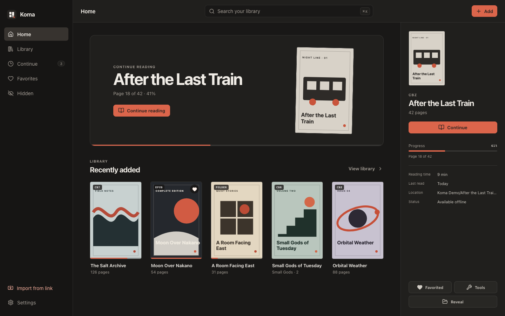
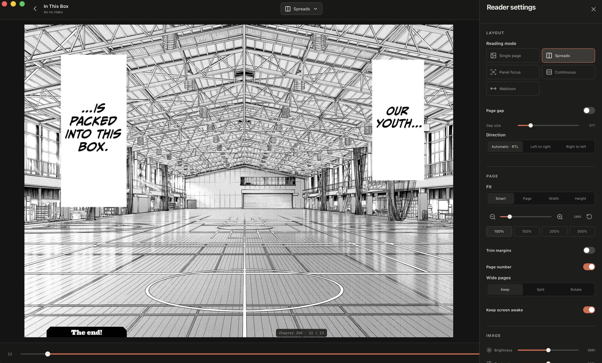
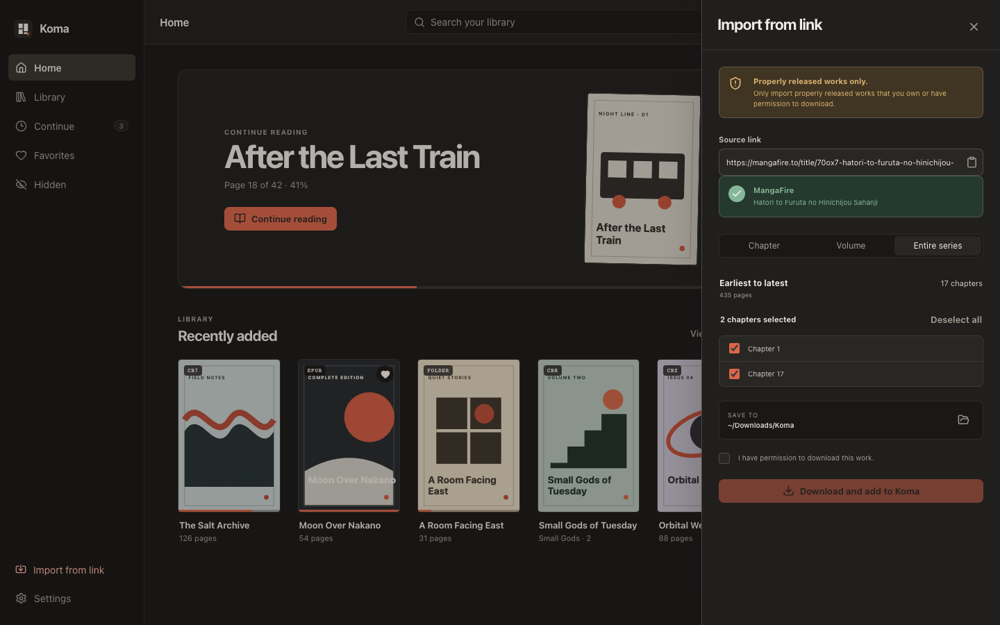
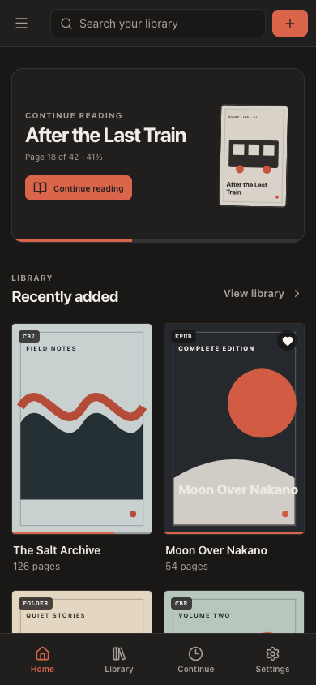
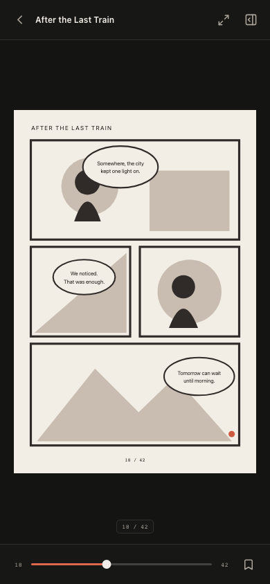
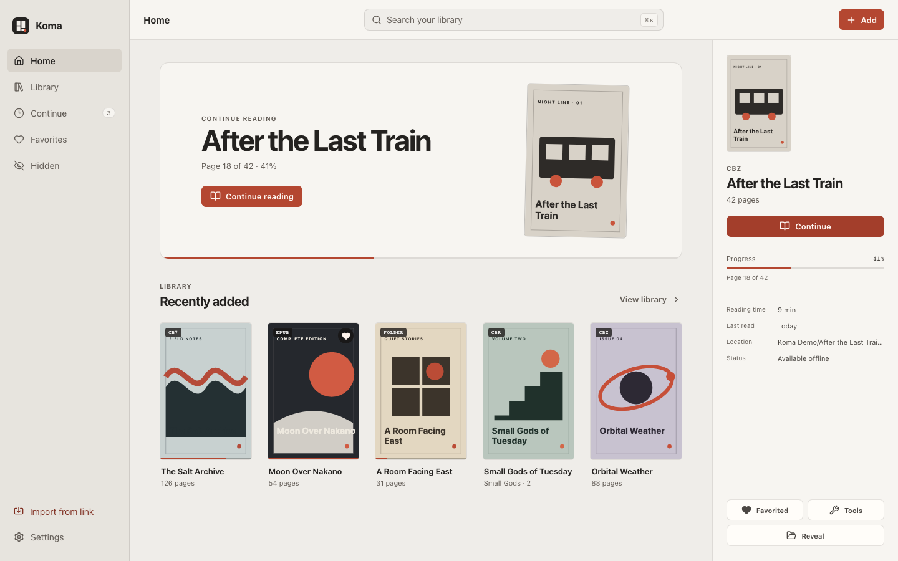

<div align="center">
  

  <h1>Koma</h1>

  <p><strong>The best way to read your manga.</strong></p>
  <p>
    A new manga and comic reader for your collection.<br>
    Built with Rust and Tauri.
  </p>

  <p>
    <a href="#get-koma">Get Koma</a>
    ·
    <a href="#inside-koma">Features</a>
    ·
    <a href="connectors/README.md">Connectors</a>
    ·
    <a href="languages/README.md">Translations</a>
  </p>

  <p>
    
    
    <a href="LICENSE"></a>
    
  </p>
</div>

<p align="center">
  
</p>

Add a book or open a source, start reading, and enjoy.
The interface stays out of the art. Simple.

Supports: `CBZ` · `CBR` · `CB7` · `CBT` · `PDF` · `EPUB`, and more.

## Simple, focused reading

It's all quiet, and that's how it's meant to be.

Koma supports left-to-right and right-to-left layouts, configurable page gaps, fit and zoom behavior, fullscreen, page
transitions, and touch controls, and all out of the way, in a nice sleek interface.

<p align="center">
  
</p>

All the settings you'd need, all at your fingertips.

## Your library

With Koma, you can bring your own collection, or use connectors to read online, directly. Choose a chapter, volume, or complete series, and start reading immediately.

Want to keep an online volume? Koma allows you to download it to your library, too.

<p align="center">
  
</p>

MangaFire support is included. Koma also reads through [custom connectors](connectors/README.md), so a connector can
add another source without changing Koma itself.

> Rhai connectors run code. Inspect connectors before installing them.

## On mobile

Koma's on mobile too, so you can enjoy the same experience anywhere.

<p align="center">
  
  &nbsp;&nbsp;&nbsp;
  
</p>

<details>
  <summary><strong>Koma in light mode</strong></summary>
  <br>
  
</details>

## Inside Koma

### Reading

- Single page, spreads, continuous, webtoon, and presentation modes
- Automatic, left-to-right, and right-to-left reading direction
- Simple, focused reading modes
- Bookmarks, page notes, reading history, and time tracking

### Library

- CBZ/ZIP, CBR/RAR, CB7/7z, CBT/TAR, image folders, PDF, and fixed-layout EPUB
- Scheduled folder scanning for large existing collections
- Hide whatever you'd like, with a Hidden section.

### Online reading and connectors

- Read a chapter, volume, or entire series online, with in-reader chapter navigation
- Download the same selected scope to your library whenever you want
- Built-in MangaFire support and extensible connectors for other sources
- Sandboxed Rhai transforms for sources that need custom response handling

### External features

- AniList and MyAnimeList account linking and progress sync
- Discord Rich Presence

## Get Koma

Koma is in active development. Desktop releases are prepared for:

| Platform | Packages                                                |
| --- |---------------------------------------------------------|
| macOS | Apple silicon .dmg                             |
| Windows | Setup .exe and .MSI                                     |
| Linux | AppImage, DEB, and RPM                                  |
| iPhone and iPad | *No released binaries yet.* Build from source with Xcode. |

Published builds will appear on the
[Releases page](https://github.com/Pixlox/Koma/releases).

### Build from source

You will need [Node.js 24](https://nodejs.org/), the
[Rust 1.93 toolchain](https://www.rust-lang.org/tools/install), and the
[Tauri prerequisites](https://v2.tauri.app/start/prerequisites/) for your
platform.

```sh
git clone https://github.com/Pixlox/Koma.git
cd Koma
npm ci
npm run tauri dev
```

Create a production bundle with:

```sh
npm run tauri build
```

If you wish to use MyAnimeList or AniList account sync, copy `.env.example` to `.env` and add your OAuth client values.

## Contributing

Koma is designed to grow, and you can help!

- [Write a connector](connectors/AUTHORING.md) as one portable
  `.koma-connector.json` file.
- [Contribute a translation](languages/README.md); complete locale files appear
  automatically in the language selector.
- [Open an issue](https://github.com/Pixlox/Koma/issues) for a reproducible bug
  or a focused feature proposal.

## License

Koma is available under the [MIT License](LICENSE).
